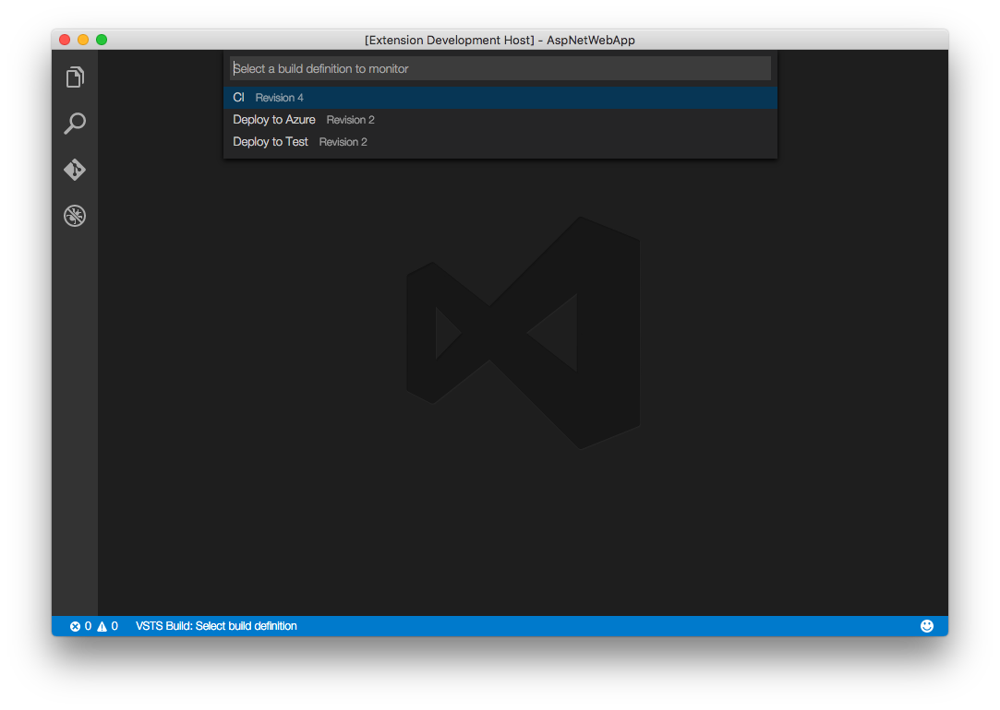
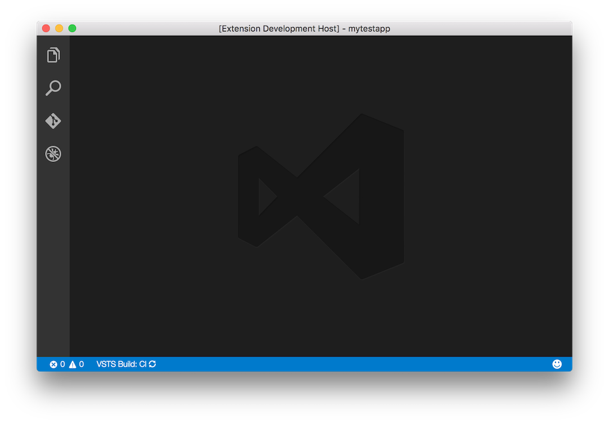
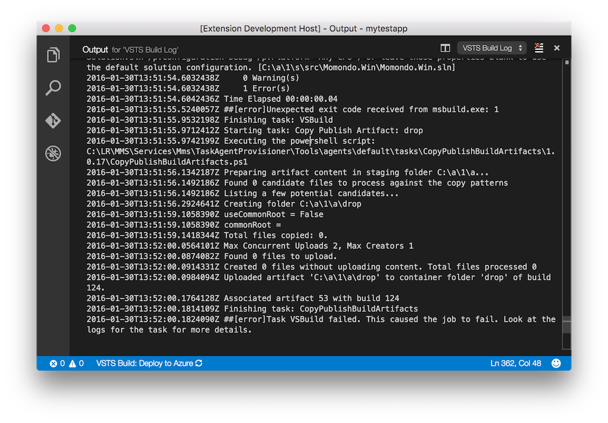

## Visual Studio Team Services Build Extension for Visual Studio Code
Work with your Visual Studio Team Services builds directly in Visual Studio Code!

Features:
- Select a build definition to monitor, and a status indicator will be visible in the status bar
- View build logs
- Stream build logs for running builds
- Open builds in browser
- Queue new builds  





The status bar icon will become visible when the necessary settings are provided (see Configuration).
A selected build definition in a specific workspace will be selected automatically the next time you open that workspace.

## Configuration
The extension is enabled by providing the following settings (user or workspace):

```json
{
    "vsts.password": "mypersonalaccesstoken",
    "vsts.account": "myaccount",
    "vsts.project": "myproject"
}
```

## License
MIT, please see LICENSE for details. Copyright (c) 2016 Jeppe Andersen.