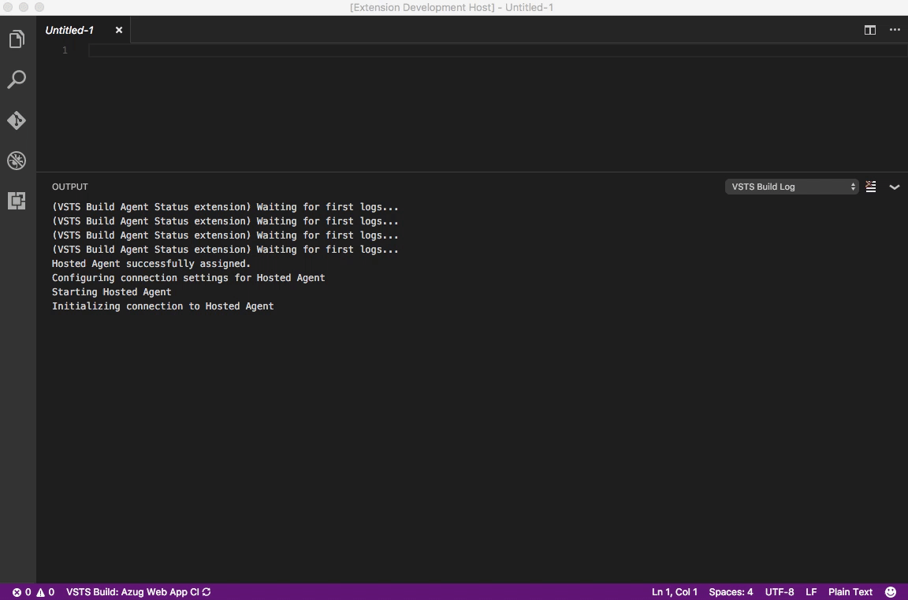

## Visual Studio Team Services Build Extension for Visual Studio Code
Work with your Visual Studio Team Services builds directly in Visual Studio Code!

Features:
- Select a build definition to monitor, and a status indicator will be visible in the status bar
- View build logs
- Stream build logs for running builds
- Open builds in browser
- Queue new builds  





The status bar icon will become visible when the necessary settings are provided (see Configuration).
A selected build definition in a specific workspace will be selected automatically the next time you open that workspace.

## Configuration
The extension is enabled by providing the following settings (user or workspace):

```json
{
    "vsts.password": "mypersonalaccesstoken",
    "vsts.account": "myaccount",
    "vsts.project": "myproject"
}
```

It also allows to add several build definitions grouped into one status bar indicator. It could be helpful if you trigger multiple builds which overall result is success only if all builds are passing (e.g. when running multiple build definitions on the same code base cross-platform). To enable grouped build definitions, add the following configuration in addition to the one at the top:

```json
{
    "vsts.definitionsGroup": "1,2,3", // IDs of build definitions to be grouped, separated with a comma
    "vsts.definitionsGroupName": "My Grouped Builds", // Name of the grouped build definitions
}
```

## Telemetry
This extension uses Microsoft Application Insights for:
- Logging unhandled errors
- Feature usage (limited to counting activations)

No data logged contain any sensitive information (only operating system is attached to the log events). This is strictly used to know about errors and how many times the different features are used - not the context of use. In addition, all automatic collection provided by Application Insights, is explicitly disabled (see []). You can disable the telemetry with the setting `vsts.telemetryEnabled` set to `false`.

## License
MIT, please see LICENSE for details. Copyright (c) 2016 Jeppe Andersen.